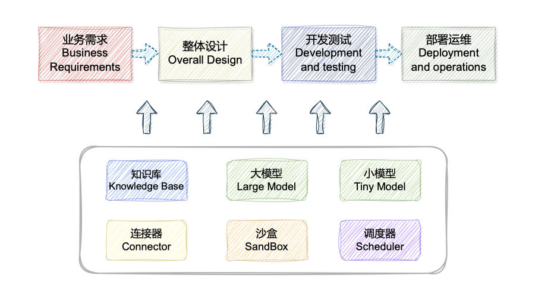
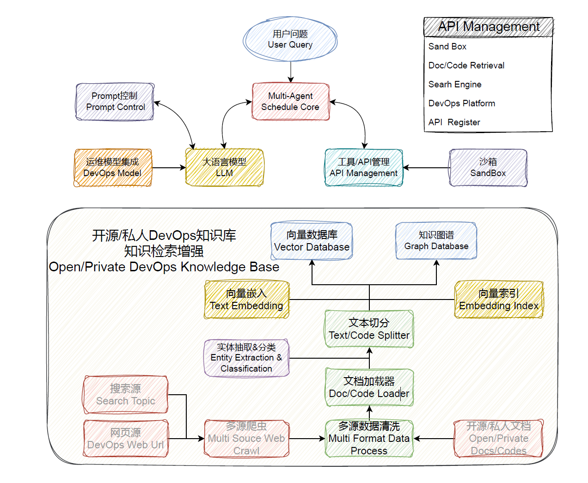

# <p align="center">Codefuse-ChatBot: Development by Private Knowledge Augmentation</p>

<p align="center">
    <a href="README.md"></a>
    <a href="README_en.md"></a>
    
    <a href="https://github.com/codefuse-ai/codefuse-chatbot/issues">
      
    </a>
    <br><br>
</p>

本项目是一个开源的 AI 智能助手，专为软件开发的全生命周期而设计，涵盖设计、编码、测试、部署和运维等阶段。通过知识检索、代码检索，工具使用和沙箱执行，Codefuse-ChatBot不仅能回答您在开发过程中遇到的专业问题，还能通过对话界面协调多个独立分散的平台。


## 🔔 更新
- [2023.12.14] 量子位公众号专题报道：[文章链接](https://mp.weixin.qq.com/s/MuPfayYTk9ZW6lcqgMpqKA)
- [2023.12.01] Multi-Agent和代码库检索功能开放
- [2023.11.15] 增加基于本地代码库的问答增强模式
- [2023.09.15] 本地/隔离环境的沙盒功能开放，基于爬虫实现指定url知识检索

## 📜 目录
- [🤝 介绍](#-介绍)
- [🎥 演示视频](#-演示视频)
- [🧭 技术路线](#-技术路线)
- [🌐 模型接入](#-模型接入)
- [🚀 快速使用](#-快速使用)
- [🤗 致谢](#-致谢)

## 🤝 介绍

💡 本项目旨在通过检索增强生成（Retrieval Augmented Generation，RAG）、工具学习（Tool Learning）和沙盒环境来构建软件开发全生命周期的AI智能助手，涵盖设计、编码、测试、部署和运维等阶段。 逐渐从各处资料查询、独立分散平台操作的传统开发运维模式转变到大模型问答的智能化开发运维模式，改变人们的开发运维习惯。

本项目核心差异技术、功能点：
- **🧠 智能调度核心：** 构建了体系链路完善的调度核心，支持多模式一键配置，简化操作流程。
- **💻 代码整库分析：** 实现了仓库级的代码深入理解，以及项目文件级的代码编写与生成，提升了开发效率。
- **📄 文档分析增强：** 融合了文档知识库与知识图谱，通过检索和推理增强，为文档分析提供了更深层次的支持。
- **🔧 垂类专属知识：** 为DevOps领域定制的专属知识库，支持垂类知识库的自助一键构建，便捷实用。
- **🤖 垂类模型兼容：** 针对DevOps领域的小型模型，保证了与DevOps相关平台的兼容性，促进了技术生态的整合。

🌍 依托于开源的 LLM 与 Embedding 模型，本项目可实现基于开源模型的离线私有部署。此外，本项目也支持 OpenAI API 的调用。

👥 核心研发团队长期专注于 AIOps + NLP 领域的研究。我们发起了 Codefuse-ai 项目，希望大家广泛贡献高质量的开发和运维文档，共同完善这套解决方案，以实现“让天下没有难做的开发”的目标。

<div align=center>
  
</div>


## 🎥 演示视频

为了帮助您更直观地了解 Codefuse-ChatBot 的功能和使用方法，我们录制了一系列演示视频。您可以通过观看这些视频，快速了解本项目的主要特性和操作流程。


- 知识库导入和问答：[演示视频](https://www.youtube.com/watch?v=UGJdTGaVnNY&t=2s&ab_channel=HaotianZhu)
- 本地代码库导入和问答：[演示视频](https://www.youtube.com/watch?v=ex5sbwGs3Kg)


## 🧭 技术路线
<div align=center>
  
</div>

- 🧠 **Multi-Agent Schedule Core:** 多智能体调度核心，简易配置即可打造交互式智能体。
- 🕷️ **Multi Source Web Crawl:** 多源网络爬虫，提供对指定 URL 的爬取功能，以搜集所需信息。
- 🗂️ **Data Processor:** 数据处理器，轻松完成文档载入、数据清洗，及文本切分，整合不同来源的数据。
- 🔤 **Text Embedding & Index:**：文本嵌入索引，用户可以轻松上传文件进行文档检索，优化文档分析过程。
- 🗄️ **Vector Database & Graph Database:** 向量与图数据库，提供灵活强大的数据管理解决方案。
- 📝 **Prompt Control & Management:**：Prompt 控制与管理，精确定义智能体的上下文环境。
- 🚧 **SandBox:**：沙盒环境，安全地执行代码编译和动作。
- 💬 **LLM:**：智能体大脑，支持多种开源模型和 LLM 接口。
- 🛠️ **API Management:：** API 管理工具，实现对开源组件和运维平台的快速集成。

具体实现明细见：[技术路线明细](sources/readme_docs/roadmap.md)


## 🌐 模型接入

如果您需要集成特定的模型，请通过提交issue来告知我们您的需求。

|      model_name    | model_size | gpu_memory | quantize | HFhub | ModelScope |
| ------------------ | ---------- | ---------- | -------- | ----- | ---------- |
|        chatgpt     |    -       |    -       |     -    | -     | -          |
| codellama-34b-int4 |     34b    |    20g     |    int4  | coming soon| [link](https://modelscope.cn/models/codefuse-ai/CodeFuse-CodeLlama-34B-4bits/summary) |


## 🚀 快速使用

请自行安装 nvidia 驱动程序，本项目已在 Python 3.9.18，CUDA 11.7 环境下，Windows、X86 架构的 macOS 系统中完成测试。

1、python 环境准备

- 推荐采用 conda 对 python 环境进行管理（可选）
```bash
# 准备 conda 环境
conda create --name devopsgpt python=3.9
conda activate devopsgpt
```

- 安装相关依赖
```bash
cd codefuse-chatbot
# python=3.9，notebook用最新即可，python=3.8用notebook=6.5.6
pip install -r requirements.txt
```

2、沙盒环境准备
- windows Docker 安装：
[Docker Desktop for Windows](https://docs.docker.com/desktop/install/windows-install/) 支持 64 位版本的 Windows 10 Pro，且必须开启 Hyper-V（若版本为 v1903 及以上则无需开启 Hyper-V），或者 64 位版本的 Windows 10 Home v1903 及以上版本。

  - [【全面详细】Windows10 Docker安装详细教程](https://zhuanlan.zhihu.com/p/441965046)
  - [Docker 从入门到实践](https://yeasy.gitbook.io/docker_practice/install/windows)
  - [Docker Desktop requires the Server service to be enabled 处理](https://blog.csdn.net/sunhy_csdn/article/details/106526991)
  - [安装wsl或者等报错提示](https://learn.microsoft.com/zh-cn/windows/wsl/install)

- Linux Docker 安装：
Linux 安装相对比较简单，请自行 baidu/google 相关安装

- Mac Docker 安装
  - [Docker 从入门到实践](https://yeasy.gitbook.io/docker_practice/install/mac)

```bash
# 构建沙盒环境的镜像，notebook版本问题见上述
bash docker_build.sh
```

3、模型下载（可选）

如需使用开源 LLM 与 Embedding 模型可以从 HuggingFace 下载。
此处以 THUDM/chatglm2-6bm 和 text2vec-base-chinese 为例：

```
# install git-lfs
git lfs install

# install LLM-model
git lfs clone https://huggingface.co/THUDM/chatglm2-6b

# install Embedding-model
git lfs clone https://huggingface.co/shibing624/text2vec-base-chinese
cp ~/shibing624/text2vec-base-chinese ~/codefuse-chatbot/embedding_models/
```


4、基础配置

```bash
# 修改服务启动的基础配置
cd configs
cp model_config.py.example model_config.py
cp server_config.py.example server_config.py

# model_config#11~12 若需要使用openai接口，openai接口key
os.environ["OPENAI_API_KEY"] = "sk-xxx"
# 可自行替换自己需要的api_base_url
os.environ["API_BASE_URL"] = "https://api.openai.com/v1"

# vi model_config#105 你需要选择的语言模型
LLM_MODEL = "gpt-3.5-turbo"

# vi model_config#43 你需要选择的向量模型
EMBEDDING_MODEL = "text2vec-base"

# vi model_config#25 修改成你的本地路径，如果能直接连接huggingface则无需修改
"text2vec-base": "shibing624/text2vec-base-chinese",

# vi server_config#8~14, 推荐采用容器启动服务
DOCKER_SERVICE = True
# 是否采用容器沙箱
SANDBOX_DO_REMOTE = True
# 是否采用api服务来进行
NO_REMOTE_API = True
```

5、启动服务

默认只启动webui相关服务，未启动fastchat（可选）。
```bash
# 若需要支撑codellama-34b-int4模型，需要给fastchat打一个补丁
# cp examples/gptq.py ~/site-packages/fastchat/modules/gptq.py
# dev_opsgpt/service/llm_api.py#258 修改为 kwargs={"gptq_wbits": 4},

# start llm-service（可选）
python dev_opsgpt/service/llm_api.py
```

```bash
# 配置好server_config.py后，可一键启动
cd examples
python start.py
```

## 🤗 致谢

本项目基于[langchain-chatchat](https://github.com/chatchat-space/Langchain-Chatchat)和[codebox-api](https://github.com/shroominic/codebox-api)，在此深深感谢他们的开源贡献！

## 联系我们
<div align=center>
  
</div>
