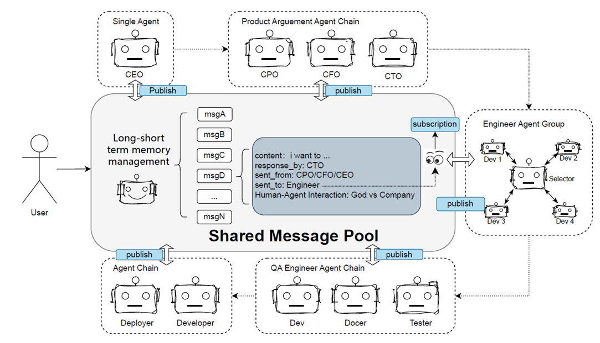
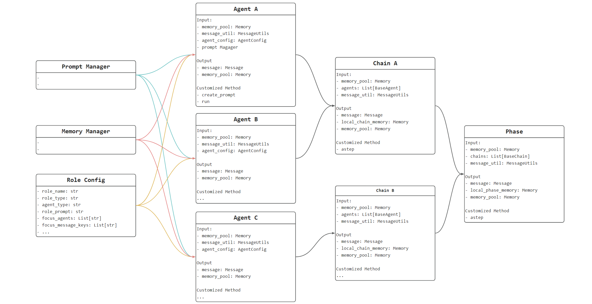

## 📜 目录
- [简介](#简介)
- [模块介绍](#模块介绍)
- [快速使用](#快速使用)

## 简介

为了提高大型模型在推理准确性方面的表现，业界出现了多种创新的大型语言模型(LLM)玩法。从最早的CoT、ToT到GoT，这些方法不断拓展了LLM的能力边界。在处理复杂问题时，我们可以通过ReAct过程来选择、调用和执行工具反馈，同时实现多轮工具使用和多步骤执行。

但对于更复杂的场景，例如复杂代码的开发，单一功能的LLM Agent显然难以胜任。因此，社区开始发展出多Agent的组合玩法，比如专注于metaGPT、GPT-Engineer、chatDev等开发领域的项目，以及专注于自动化构建Agent和Agent对话的AutoGen项目。

经过对这些框架的深入分析，发现大多数的Agent框架整体耦合度较高，其易用性和可扩展性较差。在预设场景中实现特定场景，但想要进行场景扩展却困难重重。

因此，我们希望构建一个可扩展、易于使用的Multi-Agent框架，以支持ChatBot在获取知识库信息的同时，能够辅助完成日常办公、数据分析、开发运维等各种通用任务。

本项目的Mutli-Agent框架汲取兼容了多个框架的优秀设计，比如metaGPT中的消息池（message pool）、autogen中的代理选择器（agent selector）等。

  

以下模块将从5个方面介绍Multi Agent框架所需要素：
- Agent Communication在Multi Agent框架中，确保Agent可以有效地进行信息交流对于管理上下文以及提高问答效率至关重要。
  a. 遵循简洁直观易于理解的链式对话原则，将Agent以线性方式排列串连成一个执行链路。
  b. 借鉴metaGPT中的Message Pool框架，允许Agent对Message Pool进行推送和订阅，使链路更加灵活。有利于精细化Prompt工程的场景，但难以把握复杂链路的关系分析。
- Standard Operation Process（SOP）：对LLM的生成结果进行标准化解析和处理。
  a. 定义Agent的 Input 和 Output 范围，能够组装和解析相关Action和Status，保证框架运行的稳定性
  b. 封装多种基础Action执行模块，如Tool Using、Planning、Coding、Direct Answering、final answer等SOP标识，以满足Agent的基本工作需求。 
- Plan and Executor：增加LLM的Tool使用、Agent调度、代码的生成。设置了几种基本链路，例如：
  a. 单轮问答，也可以扩展到CoT、ToT、GoT等形式。
  b. ReAct，基础的响应决策过程，模型设置SOP 状态以终止循环
  c. TaskPlaning - Executor，任务完成即可结束
- Long-short term memory Management：Multi-Agent与单Agent的关键区别在于，Multi-Agent需要处理大量的交流信息，类似人类团队协作的过程。增加一个专门负责内容总结（类似于会议助理）的Agent，对长期记忆进行总结并提更有效信息传递给下一位Agent，而非传递所有内容给下一位Agent。
- Human-agent interaction：面对复杂场景时，需要人类介入Agent交互过程并提供反馈。通过上述 Long-short term memory Management 和 Agent Communication 过程，使LLM能准确理解人类的意图，从而更有效地完成任务。

总的来说，这五个要素共同构建了一个Multi Agent框架，确保Agent之间的协作更加紧密和高效，同时也能够适应更复杂的任务需求和更多样的交互场景。通过组合多个Agent链路来实现一个完整且复杂的项目上线场景（Dev Phase），如Demand Chain（CEO）、Product Arguement Chain（CPO、CFO、CTO）、Engineer Group Chain（Selector、Developer1~N）、QA Engineer Chain（Developer、Tester）、Deploy Chain（Developer、Deploer）。

## 模块介绍
为了便于大家理解整个Multi-Agent的链路，我们采取 Flow 的形式来详细介绍如何通过配置构建

  

 下面，我们先介绍相关的模块 

### Agent
在Agent设计层面，我们提供了四种基本的Agent类型，对这些Agent进行Role的基础设定，可满足多种通用场景的交互和使用
1. BaseAgent：提供基础问答、工具使用、代码执行的功能，根据Prompt格式实现 输入 => 输出
2. ExecutorAgent：对任务清单进行顺序执行，根据 User 或 上一个Agent编排的计划，完成相关任务
3. ReactAgent：提供标准React的功能，根据问题实现当前任务
4. SelectorAgent：提供选择Agent的功能，根据User 或 上一个 Agent的问题选择合适的Agent来进行回答.

输出后将 message push 到 memory pool 之中，后续通过Memory Manager进行管理

### Chain
基础链路：BaseChain，串联agent的交互，完成相关message和memory的管理

### Phase
基础场景：BasePhase，串联chain的交互，完成相关message和memory的管理

### Prompt Manager
Mutli-Agent链路中每一个agent的prompt创建
1. 通过对promtp_input_keys和promtp_output_keys对的简单设定，可以沿用预设 Prompt Context 创建逻辑，从而实现agent prompt快速配置
2. 也可以对prompt manager模块进行新的 key-context 设计，实现个性化的 Agent Prompt
Memory Manager
主要用于 chat history 的管理，暂未完成
● 将chat history在数据库进行读写管理，包括user input、 llm output、doc retrieval、code retrieval、search retrieval
● 对 chat history 进行关键信息总结 summary context，作为 prompt context
● 提供检索功能，检索 chat history 或者 summary context 中与问题相关信息，辅助问答

### Role Config
|Config Key Name|	Type|	Description|
| ------------------ | ---------- | ---------- |
|role_prompt|	String	|角色描述|
|role_type	|String	|Enum: assistant|
|role_name	|String	|角色名称，用于后续prompt context的组装和筛选|
|agent_type	|String	|Enum：BaseAgent、SelectorAgent、ExecutorAgent、ReactAgent 也可以继承以上几种Agent然后去构造相关的Agent|
|focus_agents	|List[String]	|metagpt的逻辑，关注哪些agent生成的message，可选值范围为：role_name
|focus_message_keys	|List[String]|	额外增加的逻辑，关注message里面具体的 key 信息可选值范围为：agent 的 output_keys|
|promtp_input_keys	|List[String]	|Enum：|
|promtp_output_keys	|List[String]	|Enum：|
|chat_turn	|int	|只针对ReactAgent有效|

### Chain Config
|Config Key Name|	Type	|Description|
| ------------------ | ---------- | ---------- |
|chain_prompt	|String|	chain的描述|
|chain_name|	String	|角色名称，用于后续prompt context的组装和筛选|
|chain_type|	String|	Enum：BaseChain 也可以继承以上Chain，构造相关的Chain
|agents	|List[String]	|chain当中存在的agent以及agent的执行顺序|
|chat_turn	|int	agent之间的交互轮数|

### Phase Config
|Config Key Name	|Type	|Description|
| ------------------ | ---------- | ---------- |
|phase_name|	String|	场景名称|
|phase_type	|String	|Enum：BasePhase 也可以继承以上Phase，自定义构造相关的Phase|
|chains	|List[String]	|phase当中存在的chain以及chain的执行顺序|
|do_doc_retrieval	|bool	|在场景执行开始判断是否需要补充额外信息|
|do_code_retrieval|	bool	|在场景执行开始判断是否需要补充额外信息|
|do_tool_retrieval	|bool	|在场景执行开始判断是否需要补充额外信息|

## 快速使用
Comming soon