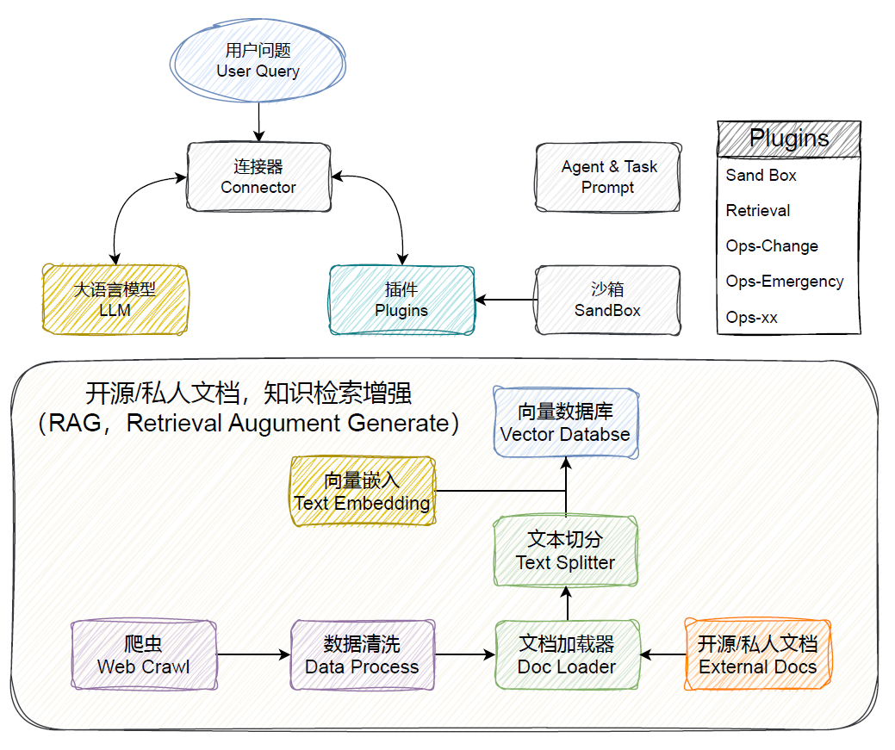

## RoadMap

  

 

完整路线
- [ ] Sandbox 环境
  - [x] 环境隔离的sandbox环境与代码执行
  - [ ] 上传、下载文件
  - [ ] 支持java执行环境
- [ ] Vector Database & Retrieval
  - [ ] llama-index 兼容向量管理
  - [ ] task retrieval
  - [ ] tool retrieval
- [ ] Prompt Control
  - [ ] prompt flow
  - [ ] 基于不同prompt管理不同任务
- [ ] Multi Agent
  - [ ] PRD需求文档、系分、接口设计
  - [ ] 根据需求文档、系分、接口设计生产代码
  - [ ] 自动测试、自动debugger
  - [ ] 运维流程接入（ToolLearning）
  - [ ] 全流程自动
- [x] 基于fastchat接入LLM
- [x] 基于sentencebert接入Text Embedding
  - [ ] 向量加载速度提升
- [ ] Connector
  - [ ] 基于langchain的react模式
  - [ ] 基于langchain完成tool检索
- [ ] Web Crawl 通用能力
  - [x] 技术文档: 知乎、csdn、阿里云开发者论坛、腾讯云开发者论坛等
  - [ ] issue document
  - [ ] SDK Library Document

  

- v0.0
- [x] Sandbox 环境
  - [x] 环境隔离的sandbox环境与代码执行
- [x] 基于fastchat接入LLM
- [x] 基于sentencebert接入Text Embedding
- [x] Web Crawl 通用能力：技术文档: 知乎、csdn、阿里云开发者论坛、腾讯云开发者论坛等
 
- v0.1
- [x] Sandbox 环境: 上传、下载文件
- [ ] Vector Database & Retrieval
  - [ ] task retrieval
  - [ ] tool retrieval
- [ ] Connector
  - [ ] 基于langchain的react模式
- [x] 基于sentencebert接入Text Embedding: 向量加载速度提升
 

- v0.2
- [ ] Prompt Control
  - [ ] prompt flow
  - [ ] 基于不同prompt管理不同任务
- [ ] Vector Database & Retrieval
  - [ ] llama-index 兼容向量管理
 

- v0.3
- [ ] Multi Agent
  - [ ] PRD需求文档、系分、接口设计
  - [ ] 根据需求文档、系分、接口设计生产代码
  - [ ] 自动测试、自动debugger
  - [ ] 运维流程接入（ToolLearning）
  - [ ] 全流程自动
- [ ] Web Crawl 通用能力
  - [ ] issue document
  - [ ] SDK Library Document
 